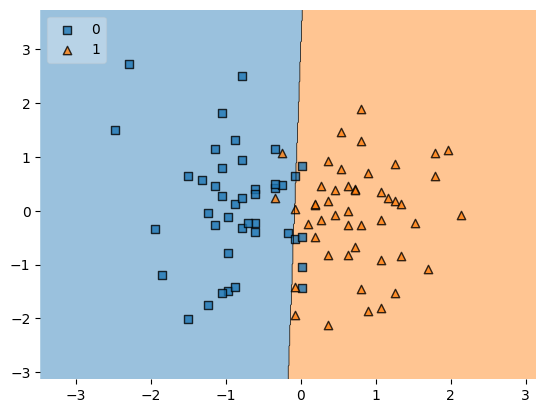

# Placement-Prediction-using-Logistic-Regression

This project predicts whether a student is likely to be placed based on their **CGPA** and **IQ** using **Logistic Regression**. It walks through the full machine learning pipeline from data preprocessing to model deployment.

## Dataset

- File: `placement.csv`
- Columns:  
  - `cgpa`: Student’s academic CGPA  
  - `iq`: Student’s IQ score  
  - `placement`: Target variable (0 - Not Placed, 1 - Placed)

---

## Steps Performed

1. **Preprocessing & EDA**
   - Dropped unnecessary index column
   - Visualized feature relationships using scatter plots

2. **Feature Selection**
   - Selected `cgpa` and `iq` as input features
   - Target variable: `placement`

3. **Train-Test Split**
   - 90% Training, 10% Testing

4. **Feature Scaling**
   - Used `StandardScaler` for normalization

5. **Model Training**
   - Trained a **Logistic Regression** model

6. **Model Evaluation**
   - Evaluated using **Accuracy Score**
   - Visualized decision boundary using `mlxtend`

7. **Model Deployment**
   - Saved trained model as `model.pkl` using `pickle`

---

## Visualization

- Decision boundary using `plot_decision_regions`

<p align="center">
  
</p>

---

## Libraries Used

```bash
numpy
pandas
matplotlib
seaborn
scikit-learn
mlxtend
pickle
